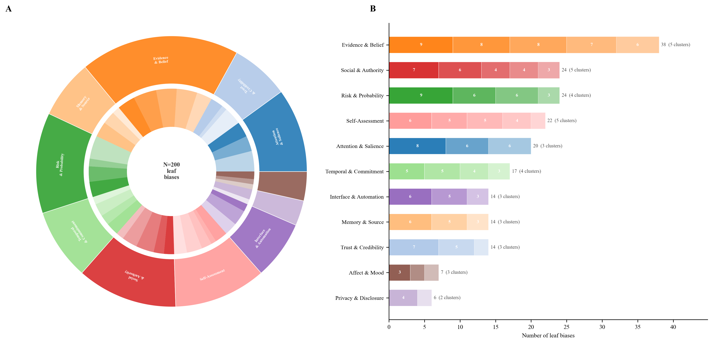
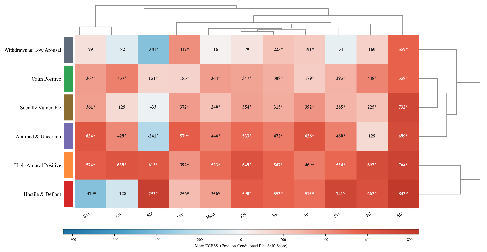

<div align="center">

# Cognitive Bias Vulnerability Across Emotional States in Cyber-Relevant Decision Contexts

### Hierarchical Emotion-Bias Mapping via LLM-based Synthetic Scoring with Latent Affective Component Analysis

**Stijn Van Severen**  
*Ghent University, Ghent, Belgium*

[](paper/report/main.tex)
[](src/protocol/osf/osf_preregistration.md)
[](docker/)
[](LICENSE)

---

</div>

## 📋 Table of Contents

- [📝 Abstract](#-abstract)
- [📌 Key Findings](#-key-findings)
- [📄 Full Paper](#-full-paper)
- [🗂️ Repository Structure](#-repository-structure)
- [🛠️ Setup and Installation](#-setup-and-installation)
- [🚀 Usage](#-usage)
- [🧬 Pipeline Overview](#-pipeline-overview)
- [📦 Outputs](#-outputs)
- [🔬 Methodological Notes](#-methodological-notes)
- [📚 Citation](#-citation)
- [⚖️ License](#-license)

## 📝 Abstract

Human susceptibility to cognitive biases in cybersecurity contexts is modulated by transient emotional states, yet no unified framework maps the full cross-domain interaction between emotion and bias across cyber-relevant cognitive vulnerabilities. This study presents a comprehensive, preregistered simulation-based investigation combining a hierarchical rapid review taxonomy (200 leaf biases, 11 families, 40 clusters) with LLM-as-judge methodology. An ensemble of **2,629 Emotion-Conditioned Bias Shift Scores (ECBSS)** was obtained across 239 emotions and all bias families using *google/gemini-3-flash-preview*. Emotions were characterized on five factor-analytically grounded affective components (Valence, Arousal, Control, Uncertainty, Social Orientation; **V-A-C-U-S**). Mixed-effects regression identified **arousal** as the dominant amplifier (β=504, p<.001) and **control/coping** as the strongest attenuator (β=−542, p<.001). Six structurally distinct emotion clusters were identified, ranging from Withdrawn/Low-Arousal (mean ECBSS=112) to High-Arousal Positive (mean=582). Affect-and-mood biases were universally amplified (mean ECBSS: 558–843), confirming mood-congruent processing as the most robust emotion-bias interaction. These findings reframe the security discourse from negative affect to *activation level* and *perceived agency*.

## 🔑 Primary Results at a Glance

The two figures below capture the structure of the taxonomy and the core vulnerability map.

**Figure 1 — Taxonomy of cyber-relevant cognitive biases**



*Panel A: Sunburst visualisation of the three-level taxonomy — 200 cognitive biases (outer ring) nested in 40 mechanistic clusters (middle ring) across 11 bias families (inner ring). Segment area reflects bias count per cluster. Panel B: Emotion landscape (UMAP) and cluster profiles — see Figure 2 in the full paper. The taxonomy was constructed through a PRISMA-informed rapid review with GPT-5.4 generative scaffolding.*

---

**Figure 3 — Cluster-by-family mean ECBSS heatmap** *(answers RQ1 & RQ3)*



*Mean Emotion-Conditioned Bias Shift Score for each of the six emotion clusters (rows) × 11 bias families (columns). Both axes are hierarchically clustered. Red = amplification; blue = attenuation. Asterisks mark cells where the 95% bootstrap CI excludes zero. The High-Arousal Positive cluster shows broad amplification across all families; the Hostile & Defiant cluster uniquely attenuates Social Influence and Trust biases.*

---

## 📌 Key Findings

- **Arousal dominates**: High-arousal emotional states (fear, panic, excitement) are the strongest amplifier of cognitive bias susceptibility (β=504, p<.001). This reframes the security discourse from negative affect to *activation level*.
- **Control attenuates**: High perceived control/agency (contempt, confidence, defiance) strongly *attenuates* bias susceptibility (β=−542, p<.001) — the largest single protective component-level effect.
- **Positive valence amplifies**: Contrary to intuitive protection accounts, positive emotional states *amplify* bias susceptibility (β=+275, p<.001), consistent with broaden-and-build mechanisms reducing threat vigilance.
- **Hostile/Defiant cluster shows selective attenuation**: Cluster 0 (anger, contempt) attenuates Social Influence (ECBSS=−379) and Trust (−128) biases, while amplifying Affective biases (+843) — a "controlled skepticism" profile.
- **Affect biases universally amplified**: The Affect & Mood family shows ECBSS 559–843 across all clusters — emotionally engaged states by definition amplify affect-heuristic-mediated biases.
- **Valence alone is insufficient**: In stacked OLS comparison, the full five-component model explains 19.2% of total ECBSS variance versus 0.4% for valence alone; across families, mean R² rises from 0.042 to 0.343.

## 📄 Full Paper

- PDF: [paper/report/main.pdf](paper/report/main.pdf)
- LaTeX source: [paper/report/main.tex](paper/report/main.tex)
- References: [paper/report/other/references.bib](paper/report/other/references.bib)

## 🗂️ Repository Structure

```text
research_paper_on_cognitive_biases_across_emotional_states/ # project root
├── README.md # project overview and workflow entry guide
├── LICENSE # MIT license
├── Makefile # shortcuts for setup, scoring, and paper build
├── pyproject.toml # package metadata and dependencies
├── .env.example # environment variable template
├── config/ # runtime and protocol configuration
│   ├── pipeline.yaml # stage toggles and canonical paths
│   ├── protocol.yaml # preregistration-linked modeling settings
│   └── search_queries.yaml # literature search query presets
├── docker/ # reproducible container setup
│   ├── .dockerignore # container context exclusions
│   ├── docker-compose.yml # compose service for workflow execution
│   └── Dockerfile # image definition for pipeline runtime
├── paper/ # manuscript sources and build artifacts
│   ├── figures/ # generated publication figures
│   ├── tables/ # generated LaTeX tables
│   └── report/ # LaTeX manuscript workspace
│       ├── generated/ # auto-generated tex fragments and exports
│       ├── main.tex # main manuscript source
│       ├── other/references.bib # bibliography database
│       └── main.pdf # compiled manuscript output
└── src/ # source-of-truth research code and data assets
  ├── cbias/ # Python package for pipeline execution
  │   ├── cli.py # command-line entrypoints
  │   ├── pipeline/ # stage orchestration logic
  │   ├── taxonomy/ # taxonomy loading and normalization helpers
  │   ├── emotion/ # emotion lexicon and affective-component prep helpers
  │   ├── scoring/ # OpenRouter semantic scoring modules
  │   ├── analysis/ # robustness and diagnostics helpers
  │   └── reporting/ # export and reporting utilities
  ├── ontologies/ # frozen conceptual resources used by the pipeline
  │   ├── taxonomy/
  │   │   └── taxonomy_cognitive_biases_cyberrelevant.json # hierarchical bias taxonomy
  │   └── emotions/
  │       └── emotional_states.txt # canonical emotion lexicon
  ├── protocol/ # preregistration and governance documents
  │   └── osf/
  │       └── osf_preregistration.md # registered protocol text
  └── review_stages/ # outputs organized by preregistered stage
    ├── 01_protocol/ # stage 1: protocol finalization
    │   ├── inputs/ # inputs consumed by this stage
    │   └── outputs/ # outputs produced by this stage
    ├── 02_search_development/ # stage 2: query design and validation
    │   ├── inputs/
    │   └── outputs/
    ├── 03_database_search/ # stage 3: database retrieval runs
    │   ├── inputs/
    │   └── outputs/
    ├── 04_record_management/ # stage 4: deduplication and record curation
    │   ├── inputs/
    │   └── outputs/
    ├── 05_title_abstract_screening/ # stage 5: title/abstract screening
    │   ├── inputs/
    │   └── outputs/
    ├── 06_full_text_eligibility/ # stage 6: full-text eligibility decisions
    │   ├── inputs/
    │   └── outputs/
    ├── 07_concept_extraction/ # stage 7: concept extraction and coding
    │   ├── inputs/
    │   └── outputs/
    ├── 08_synonym_consolidation/ # stage 8: concept/synonym harmonization
    │   ├── inputs/
    │   └── outputs/
    ├── 09_cyber_relevance_tagging/ # stage 9: cyber relevance tagging
    │   ├── inputs/
    │   └── outputs/
    ├── 10_taxonomy_construction/ # stage 10: taxonomy assembly and QA
    │   ├── inputs/
    │   └── outputs/
    ├── 11_emotion_lexicon_finalization/ # stage 11: lexicon finalization
    │   ├── inputs/
    │   └── outputs/
    ├── 12_emotion_dimension_calibration/ # stage 12: LLM semantic calibration
    │   ├── inputs/
    │   └── outputs/
    │       ├── emotion_semantic_scores_wide.csv # one row per emotion
    │       ├── emotion_semantic_scores_long.csv # one row per emotion x affective component
    │       └── emotion_semantic_scores_raw.jsonl # raw model payloads per emotion
    ├── 13_scenario_persona_prompt_calibration/ # stage 13: scenario/persona prompt setup
    │   ├── inputs/
    │   └── outputs/
    ├── 14_llm_ensemble_scoring/ # stage 14: multi-model scoring runs
    │   ├── inputs/
    │   └── outputs/
    ├── 15_robustness_sensitivity_network/ # stage 15: robustness and network analyses
    │   ├── inputs/
    │   └── outputs/
    ├── 16_confirmatory_output_freeze/ # stage 16: confirmatory freeze artifacts
    │   ├── inputs/
    │   └── outputs/
    └── 17_manuscript_preparation/ # stage 17: manuscript integration assets
      ├── inputs/
      └── outputs/
```

## 🛠️ Setup and Installation

### Option A. Local setup

```bash
python3.11 -m venv .venv
source .venv/bin/activate
python -m pip install --upgrade pip
python -m pip install -e .
cp .env.example .env
```

### Option B. Docker

```bash
docker compose -f docker/docker-compose.yml up --build
```

## 🚀 Usage

```bash
# Run the full analysis pipeline (LLM scoring + statistics + figures)
python3 src/analysis/run_pipeline.py

# Force re-run LLM scoring stages
python3 src/analysis/run_pipeline.py --force-llm

# Or use the original cbias CLI
python3 -m cbias score-emotions --max-workers 50
```

## 🧬 Pipeline Overview

```text
[Stages 1-11: Preregistered Protocol → Taxonomy → Emotion Lexicon]

Stage 12: Emotion Dimensional Calibration (V-A-C-U-S scores per emotion)
   ↓
[Analysis Pipeline: src/analysis/run_pipeline.py]
   ├── Bias Family Sensitivity Profiling (LLM, 11 families × 5 dims)
   ├── Analytical ECBSS Matrix (component-weighted dot-product method)
   ├── LLM Direct ECBSS Matrix (239 emotions × 11 families = 2,629 pairs, parallel)
   ├── Emotion Clustering (K-means k=6 in V-A-C-U-S space + UMAP)
   ├── Mixed-Effects Regression (ECBSS ~ V + A + C + U + S)
   ├── Network Analysis (bipartite emotion cluster ↔ bias family graph)
   ├── Composite Emotion Non-Additivity Tests
   └── Figure Generation (17 figures: 5 main body + 12 supplementary incl. PRISMA flow)
   ↓
[Manuscript: paper/report/main.tex → main.pdf]
```

## 📦 Key Outputs

| File | Description |
|------|-------------|
| `src/review_stages/12_emotion_dimension_calibration/outputs/emotion_semantic_scores_wide.csv` | V-A-C-U-S scores for 239 emotions |
| `src/review_stages/analysis_outputs/ecbss_direct.csv` | LLM direct ECBSS matrix (239×11) |
| `src/review_stages/analysis_outputs/ecbss_analytical.csv` | Analytical ECBSS matrix (239×11) |
| `src/review_stages/analysis_outputs/bias_sensitivity_profiles.json` | Bias family affective-component sensitivity (LLM rated) |
| `src/review_stages/analysis_outputs/regression_results.json` | Mixed-effects regression output |
| `src/review_stages/analysis_outputs/results_for_paper.json` | Key statistics summary |
| `paper/assets/figures/fig*.pdf` | All publication figures (7 main + 12 supplementary, incl. PRISMA flow) |
| `paper/assets/tables/table*.tex` | LaTeX-ready manuscript and supplementary tables |
| `paper/report/main.pdf` | **Compiled manuscript PDF** |
| `src/methodology_deviations.md` | Logged deviations from OSF preregistration |

## 🔬 Methodological Notes

### ECBSS Framework
The **Emotion-Conditioned Bias Shift Score (ECBSS)** quantifies how a specific emotional state modulates susceptibility to a cognitive bias family on a scale from −1000 (maximal attenuation) to +1000 (maximal amplification). Scores are obtained via structured zero-temperature LLM prompting with GPT-5.4 generative capabilities via the OpenRouter API, yielding 2,629 scored pairs (239 emotions × 11 bias families).

### V-A-C-U-S Components
Five factor-analytically grounded affective components characterize each emotion:
- **V** (Valence): negative → positive emotional tone
- **A** (Arousal): low activation → high activation
- **C** (Control): low perceived control → high control
- **U** (Uncertainty): certain/expected → uncertain/unexpected
- **S** (Social Orientation): self-focused → other-focused

### Preregistration Deviations
Material deviations from the OSF preregistration are documented in [`src/methodology_deviations.md`](src/methodology_deviations.md). Key deviations: (1) family-level vs. leaf-level scoring; (2) single LLM judge vs. preregistered ensemble of ≥3 models.

## 📚 Citation

```bibtex
@misc{vanseveren2026cbias,
  title        = {Cognitive Bias Vulnerability Across Emotional States in Cyber-Relevant Decision Contexts},
  author       = {Van Severen, Stijn},
  year         = {2026},
  institution  = {Ghent University},
  address      = {Ghent, Belgium},
  note         = {Preregistered study}
}
```

## ⚖️ License

This project is released under the MIT License. See [LICENSE](LICENSE).
